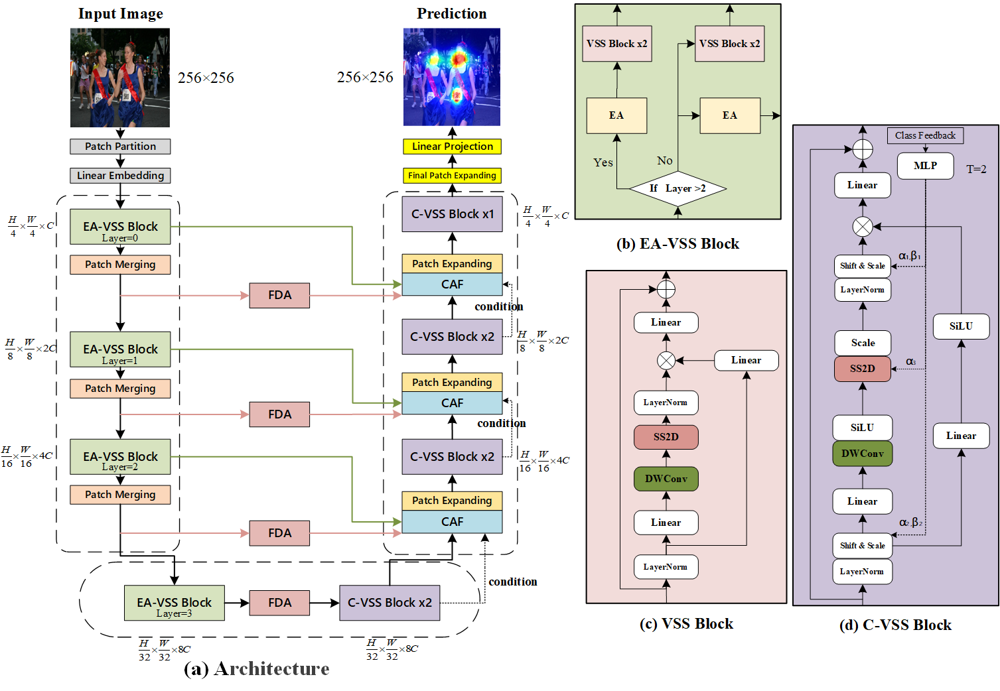
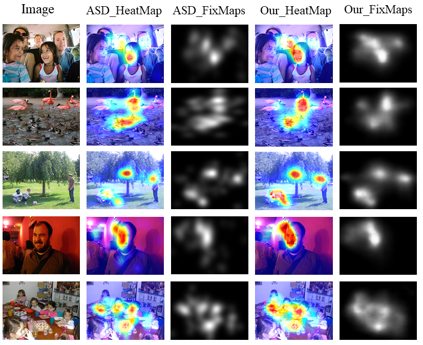

# ASD-Mamba


(a) Overview of **ASD-Mamba** model, (b) Efficient Adaptive Visual State Space (EA-VSS) block,  
(c) Visual State Space (VSS), and (d) Conditional Visual State Space (C-VSS).


# Installation

Ensure you have Python >= 3.10 installed on your system. Then, install the required libraries and dependencies.

## Requirements

Install PyTorch and other necessary libraries:

```bash
pip install -r requirements.txt
```
## Pre-trained Weights

Download the **ASD-Mamba** model from the provided Google Drive link and move it to the specified directory:

- [Download ASD-Mamba model](https://drive.google.com/file/d/13cX1OKXEgAruUt46oA96zO5lonoaoi_T/view?usp=drive_link): `ASDMamba.pth` for Atypical Visual Saliency Prediction
- Move `ASDMamba.pth` to: `net/pre_trained_weights`

# Usage
## Generate Atypical Saliency Maps

If you want to generate atypical gray saliency maps using the trained model parameters, use the `ASDgary.py` script; To generate hotmaps, use the `ASDhot.py` script. Here are the steps and commands:

```bash
python ASDgray.py
```
#### Example Images


| ASD-Mamba for atypical saliency map |
|-------------------------------------|
|    |


## Training

To train the model, first download the necessary pre-trained weights and datasets:

1. **Pretrained Encoder Weights**: Download from [VMamba GitHub](https://github.com/MzeroMiko/VMamba/releases/download/%2320240218/vssmsmall_dp03_ckpt_epoch_238.pth)  or [google drive](https://drive.google.com/file/d/1zUczEDh09Sr2HtQclYwGBvTh0Gwydr52/view?usp=sharing) and move the file to `net/pre_trained_weights/vssmsmall_dp03_ckpt_epoch_238.pth`.
2. **Datasets**: Download the typical saliency datasets, consisting of four different sets (SALICON, MIT1003, CAT2000, and SALECI), from the provided link. The zip file contains 256×256 images of stimuli, saliency maps, fixation maps, and dataset ID CSV files.
Download the atypical saliency dataset [Saliency4ASD](https://saliency4asd.ls2n.fr/) from the corresponding link. The zip file contains 256×256 images of stimuli, saliency maps, fixation maps, and dataset ID CSV files.
   - [Download Typical Saliency Datasets](https://drive.google.com/file/d/1ZEy8NnhHxPgGJ1iMgyvb8CU8vmWR3w6x/view?usp=drive_link)
To ensure the fairness of the experiments, the test set of the ASD dataset was randomly partitioned：
   - [Download Atypical Saliency Datasets](https://drive.google.com/file/d/1hpNOPE_HGe-0txuaAmR7dTgIzf6yXET4/view?usp=drive_link)

Run the training process:

```bash
python ASDtrain.py
```

## Test

Download the dataset as described above, then test the model using:

```bash
python ASDtest.py
```
